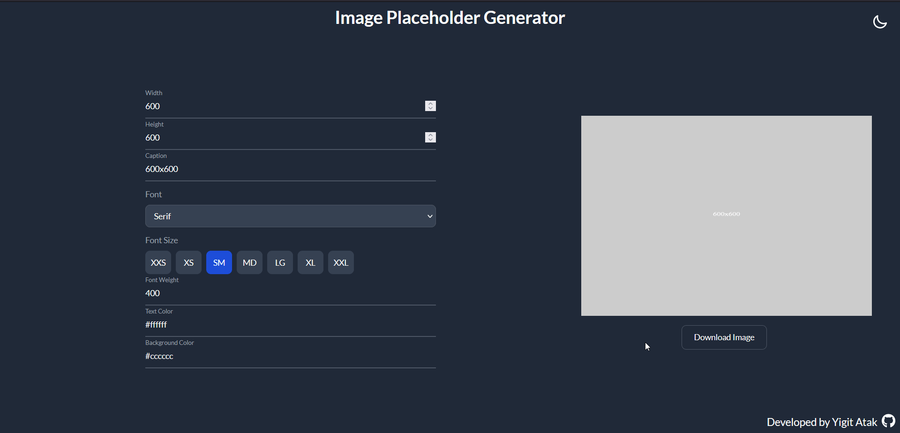
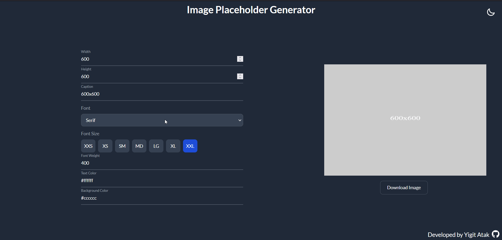
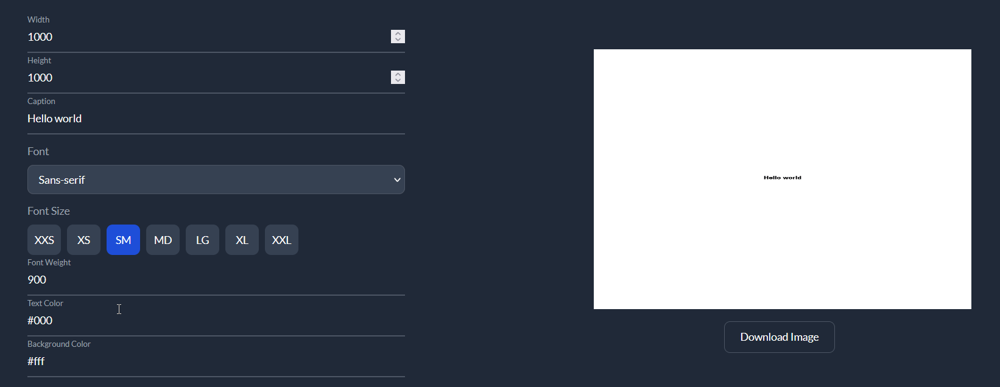

## Image Placeholder Generator by Yiğit Atak

### About the project
This project is a web application that allows you to generate a custom placeholder PNG. It utilizes the powerful HTML Canvas5 feature and converts the canvas to a PNG file. It features a dark and light theme and you can easily switch between themes to suit your needs. You can specify a width, height, font, font size, font weight, text, text color, background color and the app converts it all into a canvas which is then converted to a PNG file and served to the end-user as a downloadable file. This project will likely be developed further as time goes on. Suggestions for improvement are welcome, feel free to also fork the project and work on improvements yourself if you wish. Check the to-do list down below for my current road map for this project. 

### Features
1. Theme switcher

2. Interactive Canvas Re-painting

3. Active font size

 
### Built with
This project uses multiple libraries and frameworks.
- [React](https://tr.reactjs.org/)
- [Redux Toolkit](https://redux-toolkit.js.org/)
- [uid](https://www.npmjs.com/package/uid)
- [Tailwind CSS](https://tailwindcss.com/)
- [Daisy UI](https://daisyui.com/)
- [Font Awesome](https://fontawesome.com/)

### Getting Started
You need the following tools for installation:
- [NPM](https://www.npmjs.com/)

#### Installation
1. Clone the repo.
`git clone https://github.com/Arintia/image-placeholder-generator.git`
2. Navigate to the newly created folder.
`cd image-placeholder-generator`
3. Install all the dependencies.
`npm i`
4. Boot it up.
`npm start`
5. Happy hacking!

### Usage
This project can be used to generate placeholder images for your own projects with ease.

### Roadmap
- [ ] Fix odd behavior of canvas scaling.
- [ ] Allow different file types.

### Contributing
Contributions are what make the open source community such an amazing place to learn, inspire, and create. Any contributions you make are **greatly appreciated**.

If you found a bug or if you have a suggestion, feel free to fork this repo and create a pull request. Also feel free to open an issue and I'll get to it when I have time! If you want to work on your enhancement on your own, here's how you can achieve that:

1. Fork the project
2. Create a branch (`git checkout -b feature/SomeNewFeature`)
3. Commit your changes after you're done (`git commit -m "Add Some New Feature"`)
4. Push your commit (`git push origin feature/SomeNewFeature`)
5. Open a pull request
6. Wait for me to review it and merge it or suggest changes!

### License
This project is distributed under the [MIT](https://choosealicense.com/licenses/mit/) license. 

### Contact
You can connect with me on [LinkedIn](https://www.linkedin.com/in/yigitatak/)